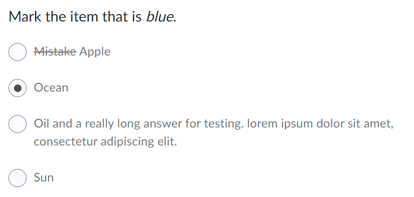
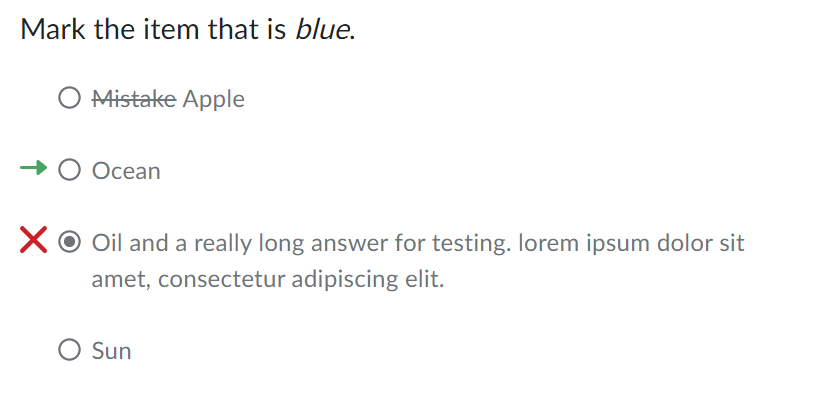

# Multiple Choice
Represents a multiple-choice question where only one option is selectable.

**Default**



**Readonly**




## Usage (Presentational)

```html
<script type="module">
    import '@brightspace-hmc/questions/components/d2l-questions-multiple-choice-presentational.js';
</script>
<d2l-questions-multiple-choice-presentational
	isTrueFalse
	readonly
	question-text=""
	.choices=${choices}
	>
</d2l-questions-multiple-choice-presentational>
```

**Properties:**

| Property | Type | Description |
|--|--|--|
| choices | Array | Object representing the possible answers and their selected state. Example below. |
| isTrueFalse | Boolean | If true, the question choices will only show two options and be translated (true & false) |
| question-text | String | Question text - will be parsed as HTML |
| readonly | Boolean | If true, the question is not clickable/ answerable and will display answer correctness if provided. |

**Example Choices:**
```JSON
[
	{
		"htmlText": "<s>Mistake</s> Apple",
		"text": "Mistake Apple",
		"selected": false,
		"correct": false
	},
	{
		"htmlText": "<p>Ocean</p>",
		"text": "Ocean",
		"selected": false,
		"correct": true
	},
	{
		"htmlText": "<p>Oil and a very long answer for testing. lorem ipsum dolor sit amet, consecteteur adipiscing elit.</p>",
		"text": "Oil and a very long answer for testing. lorem ipsum dolor sit amet, consecteteur adipiscing elit.",
		"selected": true,
		"correct": false
	},
	{
		"htmlText": "<p>Sun</p>",
		"text": "Sun",
		"selected": false,
		"correct": false
	}
]
```
