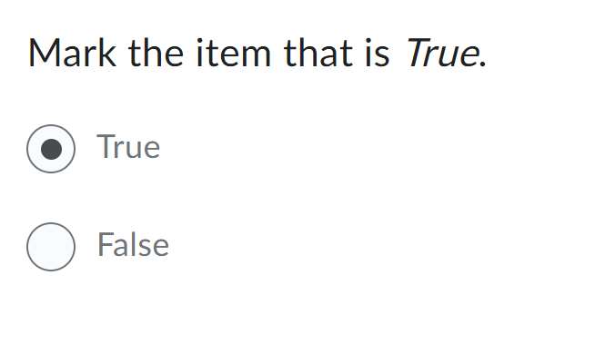
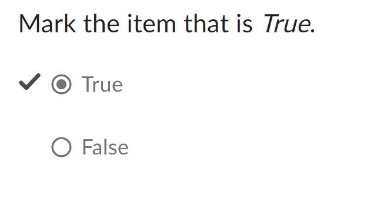

# Multiple Choice
Represents a true-false question where only one option is selectable.

**Default**



**Readonly**




## Usage (Presentational)

```html
<script type="module">
    import '@brightspace-hmc/questions/components/d2l-questions-true-false-presentational.js';
</script>
<d2l-questions-true-false-presentational
	readonly
	question-text=""
	.choices=${choices}
	>
</d2l-questions-true-false-presentational>
```

**Properties:**

| Property | Type | Description |
|--|--|--|
| choices | Array | Object representing the possible answers and their selected state. Example below. |
| question-text | String | Question text - will be parsed as HTML |
| readonly | Boolean | If true, the question is not clickable/ answerable and will display answer correctness if provided. |

**Example Choices:**
```JSON
[
	{
		"htmlText": "<s>True</s> ",
		"text": "True",
		"selected": false,
		"correct": false
	},
	{
		"htmlText": "<p>False</p>",
		"text": "False",
		"selected": false,
		"correct": true
	}
]
```
