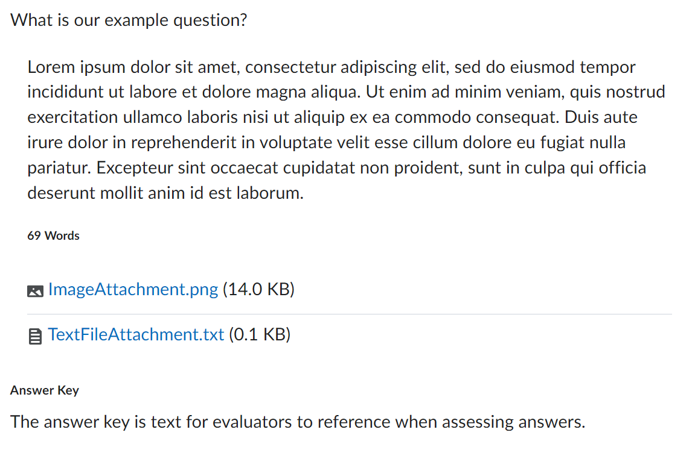

# Written Response
Represents a written response / long-answer question. Written response answers can include file attachments, and written response questions can include an answer key to display in readonly mode.

**Default**

The default 'answerable' version of this question-type has not been implemented yet.

**Readonly**



## Usage (Presentational)

```html
<script type="module">
    import '@brightspace-hmc/questions/components/d2l-questions-d2l-questions-written-response-presentational.js';
</script>

<d2l-questions-written-response-presentational
	?readonly=true
	answer-key=""
	question-text=""
	response-length=""
	response-text=""
	.responseAttachments=
	>
</d2l-questions-written-response-presentational>
```

**Properties:**

| Property | Type | Description |
|--|--|--|
| answer-key | String | Text for evaluators to reference when assessing question responses - will be parsed as HTML |
| question-text | String | Question text - will be parsed as HTML |
| readonly | Boolean | If true, the question is not clickable/ answerable and will display answer key if provided. |
| responseAttachments | Array | (Optional) Object representing files attached to the response. Example below. |
| response-length | Number | Number of words in the response text. |
| response-text | String | Text of the question response - will be parsed as HTML |

**Example Files:**
```JSON
[
	{
		"extension": "png",
		"href": "http://someurl.com/ImageAttachment.png",
		"name": "ImageAttachment.png",
		"size": "14327"
	},
	{
		"extension": "txt",
		"href": "http://someurl.com/TextFileAttachment.txt",
		"name": "TextFileAttachment.txt",
		"size": "11"
	},
]
```
*Note - size should be provided in bytes.
